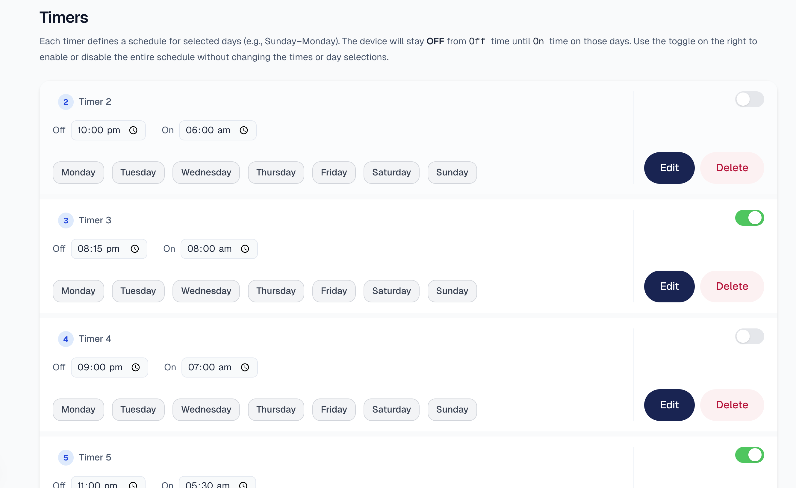

# Display Scheduler

A simple React-based project to control when your digital displays turn off and on.
This project allows you to create, edit, and manage up to 7 timers that define display schedules for specific days of the week.

---

## Features
- Add up to **7 display timers**
- Configure **On/Off times** for each timer
- Select specific **days of the week** for scheduling
- Enable/disable timers without deleting them
- Edit or delete existing timers
- Handles **success** and **failure states** for saving timers

---

## Screenshots

### 1. Timer List Page
Shows all timers with options to edit, delete, or enable/disable.


---

### 2. Edit Timer (Success State)
Example of editing a timer and saving successfully.


---

### 3. Edit Timer (Error State)
Example of a random failure when saving a timer.



---

## Getting Started

### Install Dependencies
```bash
npm install

npm run dev

npm run test

npm run test:coverage
